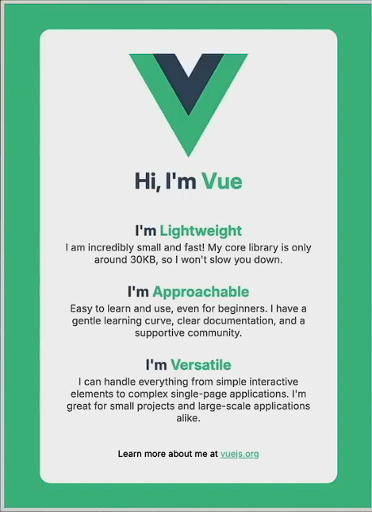
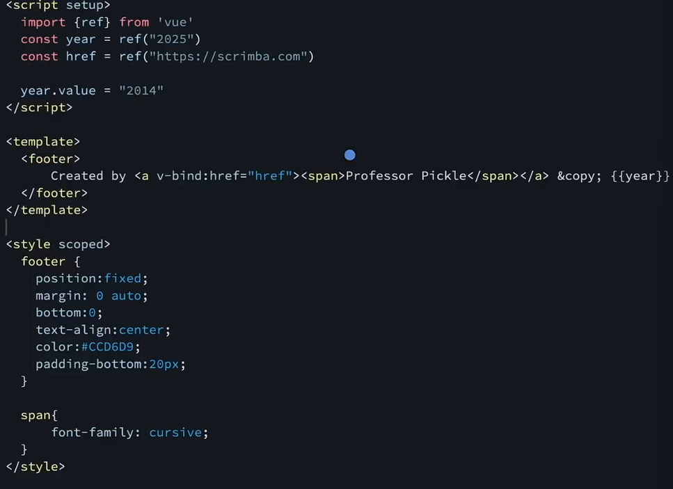

# view basics.

## Project Setup

```sh
npm install
```

### Compile and Hot-Reload for Development

```sh
npm run dev
```

### Compile and Minify for Production

```sh
npm run build
```

### Lint with [ESLint](https://eslint.org/)

```sh
npm run lint
```

### Vue Fundamentals

Vue is a JavaScript framework for building user interfaces. It builds on top of standard HTML, CSS, and JavaScript and provides a declarative, component-based programming model that helps you efficiently develop user interfaces of any complexity.

### Vue anatomy

- src
  App.vue : the main page of of vue
  main.js : link html to vue

### The view

- components

in view every code is break down into components

this is single file component

```sh
<script setup>
</script>

<template>
</template>

<style scoped>
</style>


```

- @ alias

- Reactivity

- Template syntax

- using images

### seperation of concerns

seperation of concerns is not equal to the seperation of file types

view seperate by purpose not by language 
header
main
footer

### layout components

structural components

### the @ alias

this is used to import the files like ./

this is created by vite

```js
 alias: {
      '@': fileURLToPath(new URL('./src', import.meta.url))
    },
```
this lines means replace with absolute file path.

### challange - 2



### reactivity

this function make vue update the dom on the variable update to make a variable reactice we use ref

```vue
<script setup>
import { ref } from 'node:process';
const title = ref(" <h1>Quote Generator</h1>")
</script>

<template>
  <header>
{{ title }}
  </header>
</template>

<style scoped>

h1{
  text-align: center;
  font-size: 2.5rem;
  padding: 3rem 0;
  color: rgba(255, 255, 255, 0.518);
  font-weight: 900;
}

</style>

```

### template syntax text interpolation

rendering ref
  {{title}}
  to change its value

```jsx
const title = ref(" <h1>Quote Generator</h1>")
title.value = "personalised quotes"
```


- we can also use v-bind:href attribute for img 


